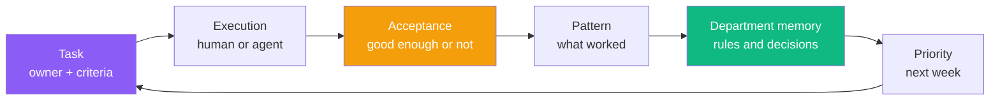
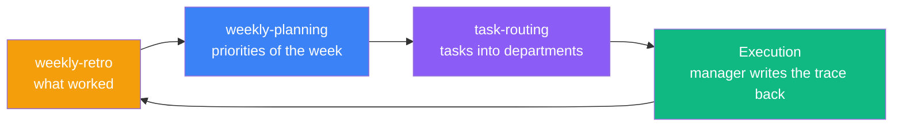
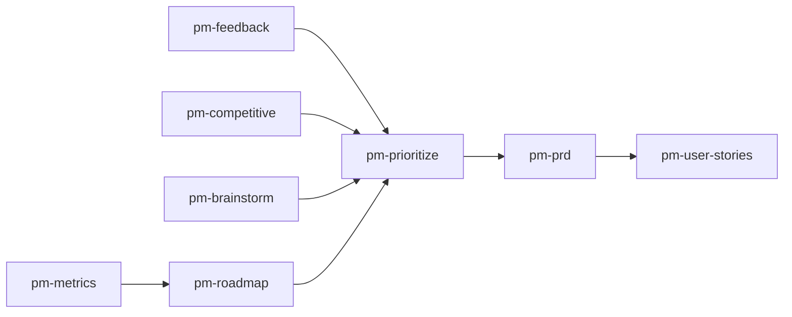

# Personal Corp OS

[](README.md)
[](README.ru.md)
[](LICENSE)
[](https://github.com/serejaris/personal-corp-os/actions/workflows/validate.yml)

> Personal Corp is a way to run a one-person company through AI agents: tasks out of your head, departments instead of one person's memory, a weekly retro instead of "I'll sort it out someday".

This repo holds the open skills for [Claude Code](https://docs.anthropic.com/en/docs/claude-code) and Codex that the framework is built from. Start with the six weekly-rhythm skills; add the rest when you need them.

By [Ris](https://t.me/ris_ai) — AI development & vibecoding.

Русская версия: [README.ru.md](README.ru.md).

## The problem: you are the bottleneck

Not because you work too little. Because strategy, memory, coordination, execution, and acceptance all sit in one pile — inside your head. While that is true, your department's throughput equals yours.

Hiring does not fix it: a new person takes the work but not the context, so you keep explaining. AI alone does not fix it either: an agent without context is the same new hire, except it does not remember yesterday.

The issue is not model strength. The issue is that context never leaves your head.

## The fix: a route, not a toolbox

Personal knowledge becomes company capital only when it travels the whole route.



Three links of that route carry most of the value.

**1. Writing the task down.** A thought becomes a task once it has an owner, done criteria, and a place to live. Before that it lives in you. After that both a human and an agent can pick it up, because they have the same access to it.

**2. Experience accumulating in departments.** Artifacts and decisions settle in a department — a separate repository for its own domain. Next time the agent reads the department instead of reading you.

**3. Retro with the agent.** Once a week you look at what worked and promote it into rules. Whatever you corrected twice becomes a written rule and stops needing you.

## The weekly rhythm

Three links on their own are a feature list. The rhythm turns them into a system.



The rhythm answers the question that usually stays unanswered: when exactly does experience turn into a rule. Answer: at the retro, once a week, not "someday".

## Departments: where experience lives

A department is a separate repository that owns one domain and accumulates its artifacts, decisions, and rules.

```
the layer      owns truth
the department owns the artifact
the agent      owns execution
acceptance     owns the "good enough" call
```

While experience sits in your head, it disappears with your attention. Once it sits in a department, the next agent and the next person both use it.

## First step: 30 minutes today

1. Install the plugin (see [Install](#install)).
2. Run [`corp-init`](./skills/corp-init/) to set up the loop: where tasks, rules, and weekly plans live.
3. Create your first department with [`corp-new`](./skills/corp-new/) and put one real task into it with [`task-routing`](./skills/task-routing/).
4. End of the week: run [`weekly-retro`](./skills/weekly-retro/). Start of the next: run [`weekly-planning`](./skills/weekly-planning/).

After two such weeks the department has its own memory, and part of the decisions stop going through you.

## The six skills of the route

| Skill | Link in the route | What it does |
|-------|-------------------|--------------|
| [corp-init](./skills/corp-init/) | The loop | Init or repair HQ, GitHub issue workflow, corp-* owner map, and agent config |
| [corp-new](./skills/corp-new/) | The department | Register a private corp-* department repo and HQ entry after approval |
| [task-routing](./skills/task-routing/) | The task | Route issues to the correct repo using routing config |
| [manager](./skills/manager/) | Execution | Sync session work into GitHub Issues and query cross-repo task state |
| [weekly-retro](./skills/weekly-retro/) | Pattern into memory | Structured retrospective: gather data, interview founder, capture findings |
| [weekly-planning](./skills/weekly-planning/) | Priority | Retro findings + backlog → prioritized outcomes with Eisenhower matrix |

## Where this leads

| Stage | How you think | Where the bottleneck is |
|-------|---------------|-------------------------|
| Vibecoder | "Me and AI" | Context in your head |
| Operator | "I direct agents" | Coordination by hand |
| CEO | "I run a system" | No bottleneck, the system runs |

Your job shrinks to three moves: set the goal, pick the next move, accept the result.

## Install

### Claude Code

Terminal:

```bash
claude plugin marketplace add serejaris/personal-corp-os
claude plugin install personal-corp-os@personal-corp-os
claude plugin details personal-corp-os
```

Claude Code Desktop or interactive `/plugin` flow:

1. Open **Plugins** or `/plugin`.
2. Add marketplace: `serejaris/personal-corp-os`.
3. Install `personal-corp-os`.

### Codex

This repo includes a Codex plugin manifest at [.codex-plugin/plugin.json](.codex-plugin/plugin.json).
Add the marketplace from GitHub, then install the plugin:

```bash
codex plugin marketplace add serejaris/personal-corp-os
codex plugin add personal-corp-os@personal-corp-os
```

After installation, start a new Codex thread and try:

```text
Use Personal Corp skills to plan my week.
```

### Migrating from personal-corp-skills

The repository was named `personal-corp-skills` until 2026-08-06. GitHub redirects the old links. The plugin identifier was renamed along with the repository, so remove the installed `personal-corp-skills` plugin via `/plugin` in Claude Code and install the new one using the instructions above.

### Single Skill

Use this when you want one skill folder instead of the whole plugin:

> Install this skill: `https://github.com/serejaris/personal-corp-os/tree/main/skills/cc-analytics`

Replace `cc-analytics` with any skill name from the table below.


## All skills
| Skill | What it does |
|-------|-------------|
| [art-director](./skills/art-director/) | Iterative visual style search with prompts, process logs, assets, and decision graphs |
| [product-data-audit](./skills/product-data-audit/) | Deep product/business audit → interactive HTML report with 12 sections |
| [cc-analytics](./skills/cc-analytics/) | HTML reports of Claude Code usage statistics |
| [ceo-council](./skills/ceo-council/) | Parallel sub-agents as C-level experts for strategic analysis |
| [claude-md-writer](./skills/claude-md-writer/) | Create and refactor CLAUDE.md files following best practices |
| [corp-new](./skills/corp-new/) | Add a private corp-* department repo and HQ entry after approval |
| [safe-public-release](./skills/safe-public-release/) | Provenance, licensing, security allowlist, approval, and fresh-clone verification for public artifacts |
| [design-minimal](./skills/design-minimal/) | Standalone minimal HTML pages for dashboards, briefs, handouts, and reports |
| [gh-issues](./skills/gh-issues/) | Manage GitHub Issues via CLI with session context |
| [meeting-copilot](./skills/meeting-copilot/) | Live meeting dashboard: prepare, update from transcript chunks, close with decisions and follow-ups |
| [readme-generator](./skills/readme-generator/) | Human-focused README files with proper structure |
| [manager](./skills/manager/) | Bidirectional bridge between the current session and GitHub Issues |
| [idea](./skills/idea/) | Capture one voiced idea into a provenance-tracked folder, dedup against an index, optional GitHub Project mirror |
| [pm-prioritize](./skills/pm-prioritize/) | Rank backlogs with RICE, ICE, MoSCoW, or Kano and produce a decision log |
| [pm-prd](./skills/pm-prd/) | Structured PRD generation with product-type templates and quality checklist |
| [pm-user-stories](./skills/pm-user-stories/) | Break Epics into INVEST-validated User Stories with Story Map output |
| [pm-competitive](./skills/pm-competitive/) | Multi-dimensional competitor analysis with SWOT and differentiation strategy |
| [pm-feedback](./skills/pm-feedback/) | Classify user feedback, cluster themes, and rank actionable pain points |
| [pm-brainstorm](./skills/pm-brainstorm/) | Structured product ideation with SCAMPER and Impact/Effort screening |
| [pm-metrics](./skills/pm-metrics/) | Product metrics review — trends, funnel/retention diagnostics, OKR alignment |
| [pm-roadmap](./skills/pm-roadmap/) | Update Now/Next/Later roadmap with delay attribution and scope-cut framework |
| [html-draft](./skills/html-draft/) | One self-contained HTML diagram in flat engineering blueprint style — architecture, flows, spec sheets |
| [parallel-design-variants](./skills/parallel-design-variants/) | Parallel design bake-off: N divergent directions via subagents, gallery, vote, then mix the winners |
| [fable-ruki-agenty](./skills/fable-ruki-agenty/) | Manually-invoked orchestration mode: Fable writes self-sufficient specs into GitHub issue bodies and dispatches ready tasks to Sonnet subagents; never writes code itself |
| [grill-me](./skills/grill-me/) | Relentless one-question-at-a-time interview about a plan until shared understanding; every fork becomes an explicit decision with a recommendation |
| [to-prd](./skills/to-prd/) | Synthesize the conversation into `PRD.md` in the project folder — no interview; testing seams; follows grill-me |
| [to-issues](./skills/to-issues/) | Split a PRD/spec into `tasks/NN-slug.md` — vertical tracer-bullet slices with acceptance criteria and dependencies |
| [tg-bot-ops](./skills/tg-bot-ops/) | Reusable operations playbook for Telegram bots and Telegram-to-agent gateways |

### Design and Media Skills

| Skill | Use When |
|-------|----------|
| [art-director](./skills/art-director/) | Iterative art direction, visual style search, generation branches, and decision graphs |
| [design-minimal](./skills/design-minimal/) | Reading-first standalone HTML pages: dashboards, briefs, handouts, operating maps, reports |
| [html-draft](./skills/html-draft/) | Technical diagrams in flat engineering blueprint style: architecture, system flows, spec sheets |
| [parallel-design-variants](./skills/parallel-design-variants/) | Several genuinely different design directions to choose from — redesign, hero, landing, thumbnail; live bake-off with voting |

### Product Management Skills

| Skill | Use When |
|-------|----------|
| [pm-feedback](./skills/pm-feedback/) | Reviews, NPS exports, or support tickets need theme clustering and pain ranking |
| [pm-competitive](./skills/pm-competitive/) | Entering a category, fundraising prep, or differentiation before a PRD |
| [pm-brainstorm](./skills/pm-brainstorm/) | Structured ideation before quarterly planning or a new product bet |
| [pm-prioritize](./skills/pm-prioritize/) | Backlog is too large — rank with RICE, ICE, MoSCoW, or Kano |
| [pm-prd](./skills/pm-prd/) | Top requirements need a delivery-ready requirements document |
| [pm-user-stories](./skills/pm-user-stories/) | PRD or Epic is ready to split into sprint-sized User Stories |
| [pm-metrics](./skills/pm-metrics/) | Weekly/monthly metrics review, A/B reads, or OKR pacing checks |
| [pm-roadmap](./skills/pm-roadmap/) | Sprint close or stakeholder review needs an updated Now/Next/Later roadmap |



### Telegram

| Skill | Use When |
|-------|----------|
| [tg-bot-ops](./skills/tg-bot-ops/) | Telegram bot and Telegram-to-agent gateway incidents, webhook/polling diagnostics, safe restart plans, Bot API smoke tests, forum topic delivery |


## Other

### [Statusline](./statusline/)
Custom statusline showing costs, context usage, and git branch with color-coded indicators.

## Archived Skills

Archived skills are preserved for reference and are not part of the active
plugin skill set.

| Skill | Notes |
|-------|-------|
| [paperclip-api](./archive/skills/paperclip-api/) | Historical Paperclip API helper; kept for reference |

## Manual Installation

Skills are plain folders. Copy the whole skill directory so optional references
and examples are preserved:

```bash
cp -r skills/<name> ~/.claude/skills/
```

## Author

- Telegram: [@ris_ai](https://t.me/ris_ai) — AI development & vibecoding
- YouTube: [@serejaris](https://www.youtube.com/@serejaris)
- [vibecoding.phd](https://vibecoding.phd)

## License

MIT

## Security

Please report secrets, private data exposure, or exploitable behavior privately.
See [SECURITY.md](SECURITY.md).
