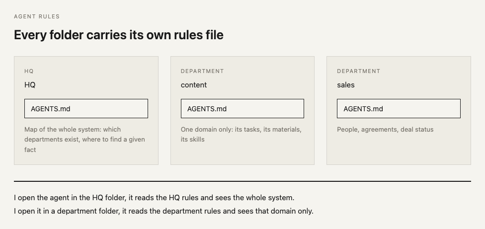
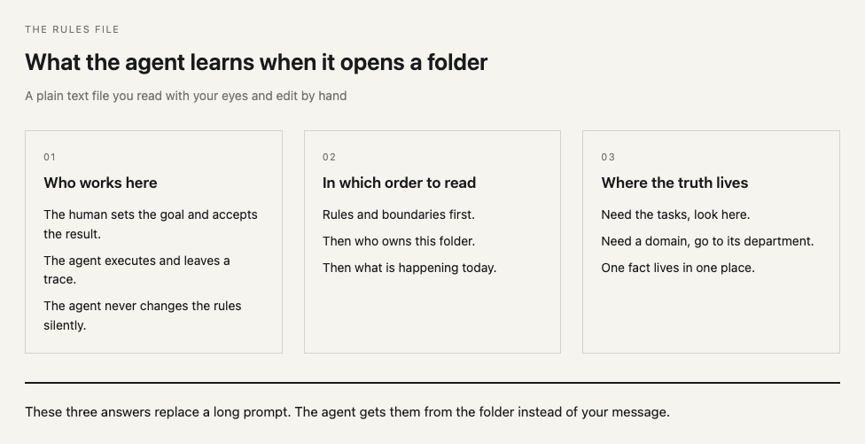
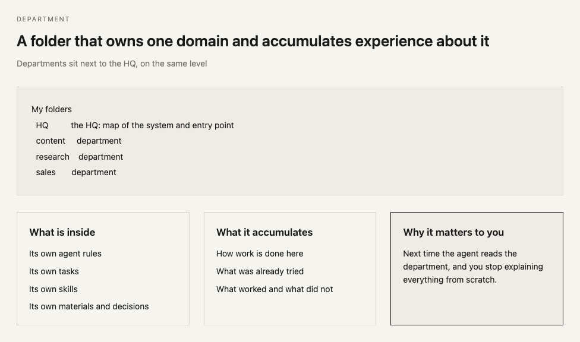
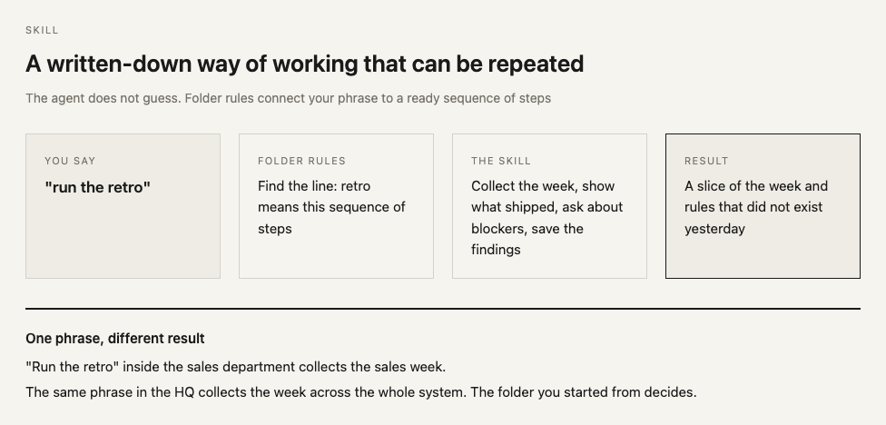
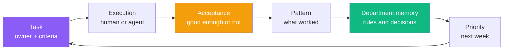
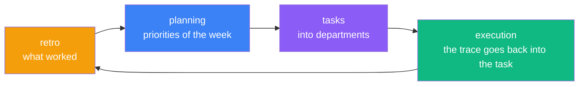
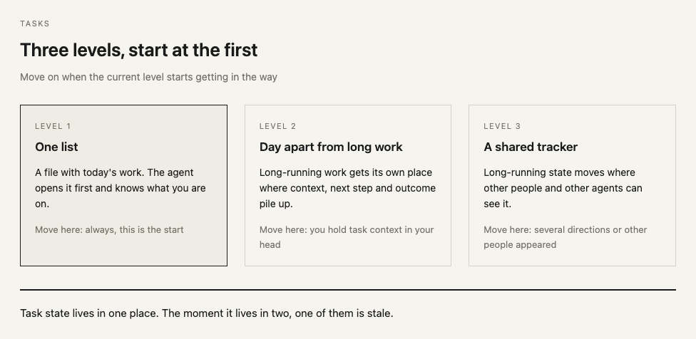

# Personal Corp OS

[](README.md)
[](README.ru.md)
[](LICENSE)
[](https://github.com/serejaris/personal-corp-os/actions/workflows/validate.yml)

> Personal Corp is a way to run a one-person company through AI agents: tasks out of your head, departments instead of one person's memory, a weekly retro instead of "I'll sort it out someday".

This repo holds everything you need for that: the story of how the system works, templates for the HQ and a department, and the open skills for [Claude Code](https://docs.anthropic.com/en/docs/claude-code) and Codex.

By [Ris](https://t.me/ris_ai) — AI development & vibecoding.

Русская версия: [README.ru.md](README.ru.md).

## The problem: you are the bottleneck

Not because you work too little. Because strategy, memory, coordination, execution, and acceptance all sit in one pile — inside your head. While that is true, your department's throughput equals yours.

Hiring does not fix it: a new person takes the work but not the context, so you keep explaining. AI alone does not fix it either: an agent without context is the same new hire, except it does not remember yesterday.

The issue is not model strength. The issue is that context never leaves your head.

## What agent rules actually are

Agent rules are a plain text file sitting in a folder. No magic: text you read with your eyes and edit by hand.

Such a file lives in every folder, and its content differs.



Opening a folder, the agent learns three things from that file.



Those three answers replace a long prompt. The agent gets them from the folder instead of your message, so you stop explaining the same thing every time.

## The core idea: the folder defines the view

Start the agent from the HQ and it reads the HQ rules and sees the map of the whole system. Start it from a department and it reads the department rules and sees that domain, its tasks, and its skills. Same model, different view, set by the folder rather than by a long prompt.

Everything else follows from that: for this to work, context has to leave your head into files, and those files have to sit in folders that carry rules.

## What a department is

A department is a folder that owns one domain and accumulates experience about it. Inside it has its own rules, its own tasks, and its own skills.



### Which departments people start with

I run about thirty. These are the usual first ones:

| Department | What it accumulates | Time to create it |
|---|---|---|
| Content | Voice, topics, finished texts, notes on what landed | You write regularly and re-explain your style every time |
| Research | Questions, found facts, sources, conclusions tied to decisions | You are looking up the same thing a second time |
| Sales | People, agreements, correspondence, deal status | You keep track of who was promised what in your head |
| Media | Briefs, prompts, finished assets, acceptance criteria | You generate images and video and the briefs get lost |
| Legal | Contracts, templates, wording you already agreed to | Every new contract is assembled from scratch |
| Finance | Expenses, subscriptions, recurring payments | You cannot recall what is charged every month |

A department exists for repetition. Work that happened once is fine living in the HQ.

## What a skill is

A skill is a written-down way of working that can be repeated. You walk the work by hand once, write the steps down, and from then on the agent runs them.



## Four layers and who lives where

| Layer | Who acts | What lives here |
|---|---|---|
| Management | The human | Goal, priorities, limits, the right to say "good enough" |
| **Truth** | The human writes, the agent reads | Rules, memory, indexes, source of truth |
| **Operations** | The agent executes, the human accepts | Tasks, queue, statuses, runs, departments |
| Observation | The agent collects, the human looks | Dashboards, metrics, blockers |

A subagent lives only in the operations layer: it does not write truth about the system and does not accept results.

One test for any file: **is this truth about the system, or is it the result of work?** Truth sits in the folder from day one. Results are created by skills once there is something to record. That is why the templates ship no empty files for future reports, decisions, or glossaries.

## The route: how experience becomes capital



**1. Writing the task down.** A thought becomes a task once it has an owner, done criteria, and a place to live. Before that it lives in you. After that both a human and an agent can pick it up.

**2. Experience accumulating in departments.** Artifacts and decisions settle in a department — a separate folder for its own domain. Next time the agent reads the department instead of reading you.

**3. Retro with the agent.** Once a week you look at what worked and promote it into rules. Whatever you corrected twice becomes a written rule and stops needing you.

## The weekly rhythm

Three links on their own are a feature list. The rhythm turns them into a system.



The rhythm answers the question that usually stays unanswered: when exactly does experience turn into a rule. Answer: at the retro, once a week, not "someday".

The same word gives a different result depending on the folder: "retro" inside a department means a slice of that department, "retro" in the HQ means a slice of the whole system. Folder rules win over general ones.

## Three levels of task tracking



## Templates

| Template | What it is |
|---|---|
| [`templates/hq`](./templates/hq/) | The HQ — the agent's entry point and the map of the system |
| [`templates/department`](./templates/department/) | A department — one domain with its own tasks and skills |

Departments sit **next to the HQ, not inside it**. Every template file opens with a line stating why it is there and which layer it belongs to.

## First step: 30 minutes today

1. Copy [`templates/hq`](./templates/hq/) to your machine and fill in `me.md`.
2. Open the agent from that folder and ask it to read `AGENTS.md`.
3. Create your first department from [`templates/department`](./templates/department/) next to the HQ and put one real task into it.
4. Install the plugin (see [Install](#install)) — it brings the weekly-rhythm skills.
5. Run the retro at the end of the week and planning at the start of the next one.

After two such weeks the department has its own memory, and part of the decisions stop going through you.

## The four skills of the rhythm

| Skill | Link in the route | What it does |
|-------|-------------------|--------------|
| [corp-doctor](./skills/corp-doctor/) | Loop, department, task | Diagnose and repair the loop, add a department, route a task |
| [manager](./skills/manager/) | Execution | Sync session work into GitHub Issues and query cross-repo task state |
| [weekly-retro](./skills/weekly-retro/) | Pattern into memory | Structured retrospective: gather data, interview founder, capture findings |
| [weekly-planning](./skills/weekly-planning/) | Priority | Retro findings + backlog → prioritized outcomes with Eisenhower matrix |

## Where this leads

| Stage | How you think | Where the bottleneck is |
|-------|---------------|-------------------------|
| Vibecoder | "Me and AI" | Context in your head |
| Operator | "I direct agents" | Coordination by hand |
| CEO | "I run a system" | No bottleneck, the system runs |

Your job shrinks to three moves: set the goal, pick the next move, accept the result.

Glossary — [CONTEXT.md](CONTEXT.md). Accepted architectural decisions — [docs/adr/](docs/adr/).

## Install

### Claude Code

Terminal:

```bash
claude plugin marketplace add serejaris/personal-corp-os
claude plugin install personal-corp-os@personal-corp-os
claude plugin details personal-corp-os
```

Claude Code Desktop or interactive `/plugin` flow:

1. Open **Plugins** or `/plugin`.
2. Add marketplace: `serejaris/personal-corp-os`.
3. Install `personal-corp-os`.

### Codex

This repo includes a Codex plugin manifest at [.codex-plugin/plugin.json](.codex-plugin/plugin.json).
Add the marketplace from GitHub, then install the plugin:

```bash
codex plugin marketplace add serejaris/personal-corp-os
codex plugin add personal-corp-os@personal-corp-os
```

After installation, start a new Codex thread and try:

```text
Use Personal Corp skills to plan my week.
```

### Migrating from personal-corp-skills

The repository was named `personal-corp-skills` until 2026-08-06. GitHub redirects the old links. The plugin identifier was renamed along with the repository, so remove the installed `personal-corp-skills` plugin via `/plugin` in Claude Code and install the new one using the instructions above.

### Single Skill

Use this when you want one skill folder instead of the whole plugin:

> Install this skill: `https://github.com/serejaris/personal-corp-os/tree/main/skills/cc-analytics`

Replace `cc-analytics` with any skill name from the table below.


## All skills

### System rhythm

| Skill | What it does |
|---|---|
| [corp-doctor](./skills/corp-doctor/) | One entry point to the loop: diagnose, repair, new department, task routing |
| [manager](./skills/manager/) | Two-way bridge between the session and GitHub Issues, cross-repo status |
| [weekly-retro](./skills/weekly-retro/) | Weekly retro: gather facts, interview the founder, capture findings |
| [weekly-planning](./skills/weekly-planning/) | Retro findings and backlog become prioritized outcomes for the week |

### From intent to tasks

| Skill | What it does |
|---|---|
| [idea](./skills/idea/) | Capture one voiced idea into a provenance-tracked folder with index dedup |
| [grill-me](./skills/grill-me/) | One question at a time until the plan is actually clear |
| [to-prd](./skills/to-prd/) | Synthesize the conversation into `PRD.md` with no new interview |
| [to-issues](./skills/to-issues/) | Split a PRD into vertical `tasks/NN-slug.md` slices with acceptance criteria |
| [gh-issues](./skills/gh-issues/) | Manage GitHub Issues through the CLI with session context |

### Product work

| Skill | What it does |
|---|---|
| [pm-brainstorm](./skills/pm-brainstorm/) | Structured ideation with SCAMPER and impact/effort screening |
| [pm-feedback](./skills/pm-feedback/) | Classify feedback, cluster themes, rank actionable pains |
| [pm-competitive](./skills/pm-competitive/) | Competitor analysis with SWOT, feature matrix, differentiation |
| [pm-prioritize](./skills/pm-prioritize/) | Rank the backlog with RICE, ICE, MoSCoW, or Kano |
| [pm-prd](./skills/pm-prd/) | Structured PRD generation with product-type templates |
| [pm-user-stories](./skills/pm-user-stories/) | Break an epic into INVEST user stories with a story map |
| [pm-metrics](./skills/pm-metrics/) | Product metrics review: funnel, retention, alignment with goals |
| [pm-roadmap](./skills/pm-roadmap/) | Update the Now/Next/Later roadmap with delay attribution |
| [product-data-audit](./skills/product-data-audit/) | Deep product and business audit as a 12-section interactive report |

### Design and media

| Skill | What it does |
|---|---|
| [art-director](./skills/art-director/) | Iterative visual style search with a process log and a decision graph |
| [design-minimal](./skills/design-minimal/) | One standalone HTML page: dashboard, brief, handout, report |
| [html-draft](./skills/html-draft/) | One technical diagram in flat blueprint style: architecture, flows |
| [parallel-design-variants](./skills/parallel-design-variants/) | Parallel bake-off through subagents, gallery, vote, then a mix |

### Agent orchestration

| Skill | What it does |
|---|---|
| [ceo-council](./skills/ceo-council/) | Parallel subagents as C-level experts for strategic analysis |
| [fable-ruki-agenty](./skills/fable-ruki-agenty/) | Manual orchestration mode: specs into issues, execution to subagents |

### Docs and rules

| Skill | What it does |
|---|---|
| [readme-generator](./skills/readme-generator/) | Human-focused README files with proper structure |
| [claude-md-writer](./skills/claude-md-writer/) | Create and refactor the agent rules file following best practices |

### Operations

| Skill | What it does |
|---|---|
| [meeting-copilot](./skills/meeting-copilot/) | Live meeting dashboard: prepare, update from transcript, close with decisions |
| [cc-analytics](./skills/cc-analytics/) | HTML report of Claude Code usage statistics |
| [safe-public-release](./skills/safe-public-release/) | Provenance, licensing, allowlist, and fresh-clone checks before publishing |
| [tg-bot-ops](./skills/tg-bot-ops/) | Operations playbook for Telegram bots and agent gateways |

## Other

### [Statusline](./statusline/)
Custom statusline showing costs, context usage, and git branch with color-coded indicators.

## Archived Skills

Archived skills are preserved for reference and are not part of the active
plugin skill set.

| Skill | Notes |
|-------|-------|
| [paperclip-api](./archive/skills/paperclip-api/) | Historical Paperclip API helper; kept for reference |

## Manual Installation

Skills are plain folders. Copy the whole skill directory so optional references
and examples are preserved:

```bash
cp -r skills/<name> ~/.claude/skills/
```

## Author

- Telegram: [@ris_ai](https://t.me/ris_ai) — AI development & vibecoding
- YouTube: [@serejaris](https://www.youtube.com/@serejaris)
- [vibecoding.phd](https://vibecoding.phd)

## License

MIT

## Security

Please report secrets, private data exposure, or exploitable behavior privately.
See [SECURITY.md](SECURITY.md).
