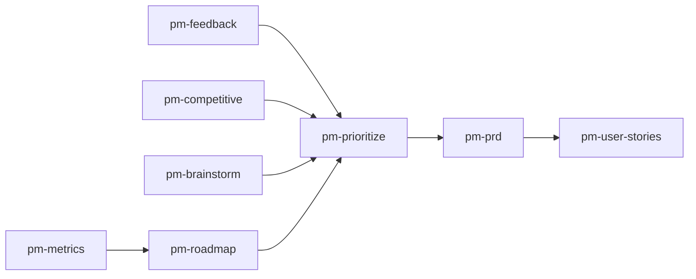

# Personal Corp Skills

[](README.md)
[](README.ru.md)
[](LICENSE)
[](https://github.com/serejaris/personal-corp-skills/actions/workflows/validate.yml)

> Personal Corp — способ управлять личной компанией через AI-агентов: задачи вне головы, отделы вместо памяти одного человека, недельное ретро вместо «когда-нибудь разберусь».

Здесь лежат открытые скиллы для [Claude Code](https://docs.anthropic.com/en/docs/claude-code) и Codex, которыми этот фреймворк собирается. Начните с шести скиллов недельного ритма, остальные подключайте по мере надобности.

От [Ris](https://t.me/ris_ai) — пишу про AI-разработку и вайбкодинг.

English version: [README.md](README.md).

## Проблема: вы бутылочное горлышко

Не потому что мало работаете. Потому что стратегия, память, координация, исполнение и приёмка лежат в одной куче — у вас в голове. Пока это так, пропускная способность отдела равна вашей.

Найм не расшивает горлышко: человек забирает работу, но не контекст, и вы продолжаете объяснять. ИИ сам по себе тоже не расшивает: агент без контекста — тот же новый сотрудник, только он ещё и не помнит вчера.

Дело не в силе модели. Дело в том, что контекст не выходит из головы.

## Решение: маршрут, а не набор инструментов

Личное знание становится капиталом компании только когда проезжает маршрут целиком.


Три звена этого маршрута дают больше всего.

**1. Описание задачи.** Мысль становится задачей, когда у неё есть владелец, критерии готовности и место, где она лежит. До этого она живёт в вас. После — её может взять и человек, и агент, потому что доступ к ней одинаковый.

**2. Накопление опыта в отделах.** Артефакты и решения оседают в отделе — отдельном репозитории по своему домену. В следующий раз агент читает не вас, а отдел.

**3. Ретро с агентом.** Раз в неделю вы вместе смотрите, что сработало, и поднимаете это в правила. То, что вы поправили дважды, становится строкой правил и больше не требует вашего участия.

## Недельный ритм

Три звена по отдельности — список возможностей. Ритм превращает их в систему.


Ритм отвечает на вопрос, который обычно остаётся без ответа: когда именно опыт превращается в правило. Ответ: на ретро, раз в неделю, а не «когда-нибудь потом».

## Отделы: где живёт опыт

Отдел — отдельный репозиторий, который отвечает за свой домен и копит по нему артефакты, решения и правила.

```
слой     владеет истиной
отдел    владеет артефактом
агент    владеет исполнением
приёмка  владеет решением «годится»
```

Пока опыт лежит в вашей голове, он исчезает вместе с вашим вниманием. Как только он лежит в отделе, им пользуются и следующий агент, и следующий человек.

## Первый шаг: 30 минут сегодня

1. Поставить плагин (см. [Установка](#установка)).
2. Запустить [`corp-init`](./skills/corp-init/) — собрать контур: где живут задачи, правила и планы недели.
3. Завести первый отдел через [`corp-new`](./skills/corp-new/) и положить в него одну реальную задачу через [`task-routing`](./skills/task-routing/).
4. В конце недели запустить [`weekly-retro`](./skills/weekly-retro/), в начале следующей — [`weekly-planning`](./skills/weekly-planning/).

После двух таких недель у отдела появляется собственная память, и часть решений перестаёт проходить через вас.

## Шесть скиллов маршрута

| Скилл | Звено маршрута | Что делает |
|-------|----------------|------------|
| [corp-init](./skills/corp-init/) | Контур | Настройка или ремонт HQ, GitHub issue workflow, corp-* owner map и agent config |
| [corp-new](./skills/corp-new/) | Отдел | Регистрация приватного corp-* репозитория отдела и HQ-записи после подтверждения |
| [task-routing](./skills/task-routing/) | Задача | Маршрутизация issues в правильный репозиторий через конфиг |
| [manager](./skills/manager/) | Исполнение | Синк работы сессии в GitHub Issues и cross-repo запросы по задачам |
| [weekly-retro](./skills/weekly-retro/) | Паттерн в память | Структурированное ретро: сбор данных, интервью с основателем, фиксация в issues |
| [weekly-planning](./skills/weekly-planning/) | Приоритет | Ретро и бэклог — приоритизированные outcomes с матрицей Эйзенхауэра |

## Куда это ведёт

| Стадия | Как думаете | Где горлышко |
|--------|-------------|--------------|
| Вайбкодер | «Я и AI» | Контекст в голове |
| Оператор | «Я направляю агентов» | Координация вручную |
| CEO | «Я управляю системой» | Горлышка нет, система работает |

Ваша работа сжимается до трёх действий: задать цель, выбрать следующий ход, принять результат.

## Установка

### Claude Code

В терминале:

```bash
claude plugin marketplace add serejaris/personal-corp-skills
claude plugin install personal-corp-skills@personal-corp-skills
claude plugin details personal-corp-skills
```

В Claude Code Desktop или interactive `/plugin` flow:

1. Откройте **Plugins** или `/plugin`.
2. Добавьте marketplace: `serejaris/personal-corp-skills`.
3. Установите `personal-corp-skills`.

### Codex

В репозитории есть Codex manifest: [.codex-plugin/plugin.json](.codex-plugin/plugin.json).
Добавьте marketplace из GitHub, затем установите плагин:

```bash
codex plugin marketplace add serejaris/personal-corp-skills
codex plugin add personal-corp-skills@personal-corp-skills
```

После установки откройте новый Codex thread и проверьте:

```text
Use Personal Corp skills to plan my week.
```

### Один скилл

Используйте этот вариант, если нужна одна папка скилла:

> Install this skill: `https://github.com/serejaris/personal-corp-skills/tree/main/skills/cc-analytics`

Замените `cc-analytics` на имя любого скилла из таблицы ниже.


## Все скиллы
| Скилл | Что делает |
|-------|-----------|
| [art-director](./skills/art-director/) | Итеративный поиск визуального стиля с промптами, журналом процесса, ассетами и графами решений |
| [product-data-audit](./skills/product-data-audit/) | Глубокий аудит продукта/бизнеса — интерактивный HTML-отчёт на 12 секций |
| [cc-analytics](./skills/cc-analytics/) | HTML-отчёты статистики использования Claude Code |
| [ceo-council](./skills/ceo-council/) | Параллельные субагенты в роли C-level экспертов для стратегического анализа |
| [claude-md-writer](./skills/claude-md-writer/) | Создание и рефакторинг CLAUDE.md по best practices |
| [corp-new](./skills/corp-new/) | Добавление приватного corp-* репозитория отдела и HQ-записи после подтверждения |
| [safe-public-release](./skills/safe-public-release/) | Provenance, лицензии, security allowlist, approval и fresh-clone проверка публичных артефактов |
| [design-minimal](./skills/design-minimal/) | Одна HTML-страница в минимальном стиле для дашбордов, брифов, раздаток и отчётов |
| [gh-issues](./skills/gh-issues/) | Управление GitHub Issues через CLI с хранением контекста сессий |
| [meeting-copilot](./skills/meeting-copilot/) | Live dashboard для встреч: подготовка, обновление из транскрипта, закрытие с решениями и follow-up |
| [readme-generator](./skills/readme-generator/) | Человеко-ориентированные README с правильной структурой |
| [manager](./skills/manager/) | Двусторонний мост между текущей сессией и GitHub Issues |
| [idea](./skills/idea/) | Захват одной озвученной идеи в папку-с-провенансом, дедуп по индексу, опциональное зеркало в GitHub Project |
| [pm-prioritize](./skills/pm-prioritize/) | Ранжирование бэклогов через RICE, ICE, MoSCoW или Kano |
| [pm-prd](./skills/pm-prd/) | Генерация структурированного PRD с шаблонами под тип продукта |
| [pm-user-stories](./skills/pm-user-stories/) | Разбивка Epic на User Stories с INVEST и Story Map |
| [pm-competitive](./skills/pm-competitive/) | Конкурентный анализ: SWOT, feature-матрица, дифференциация |
| [pm-feedback](./skills/pm-feedback/) | Классификация фидбека, кластеризация тем, ранжирование болей |
| [pm-brainstorm](./skills/pm-brainstorm/) | Структурированный продуктовый брейншторм с SCAMPER |
| [pm-metrics](./skills/pm-metrics/) | Ревью продуктовых метрик, воронка/retention, OKR alignment |
| [pm-roadmap](./skills/pm-roadmap/) | Обновление roadmap Now/Next/Later с атрибуцией задержек |
| [html-draft](./skills/html-draft/) | Одна HTML-диаграмма в стиле плоского инженерного чертежа — архитектура, потоки, spec sheets |
| [parallel-design-variants](./skills/parallel-design-variants/) | Параллельный design bake-off: N разных направлений через субагентов, галерея, голосование, потом микс победителей |
| [fable-ruki-agenty](./skills/fable-ruki-agenty/) | Ручной режим оркестрации: Fable пишет самодостаточные спеки в тела GH issues и раздаёт готовые задачи субагентам на Sonnet; сам код не пишет |
| [grill-me](./skills/grill-me/) | Безжалостное интервью по плану, по одному вопросу за раз, до общего понимания; каждая развилка — явное решение с рекомендацией |
| [to-prd](./skills/to-prd/) | Синтез обсуждения в `PRD.md` в папке проекта — без интервью; швы для тестов; цепочка после grill-me |
| [to-issues](./skills/to-issues/) | Разбивка PRD/спеки на `tasks/NN-slug.md` — вертикальные tracer-bullet срезы, критерии приёмки и зависимости |
| [tg-bot-ops](./skills/tg-bot-ops/) | Переиспользуемый операционный плейбук для Telegram-ботов и Telegram-to-agent gateways |

### Дизайн и медиа

| Скилл | Когда использовать |
|-------|--------------------|
| [art-director](./skills/art-director/) | Итеративный art direction, поиск визуального стиля, ветки генерации и графы решений |
| [design-minimal](./skills/design-minimal/) | Читаемые standalone HTML-страницы: дашборды, брифы, раздатки, операционные карты, отчёты |
| [html-draft](./skills/html-draft/) | Технические диаграммы в стиле плоского инженерного чертежа: архитектура, system flows, spec sheets |
| [parallel-design-variants](./skills/parallel-design-variants/) | Несколько по-настоящему разных дизайн-направлений на выбор — редизайн, hero, лендинг, обложка; лайв-bake-off с голосованием |

### Продуктовые скиллы

| Скилл | Когда использовать |
|-------|--------------------|
| [pm-feedback](./skills/pm-feedback/) | Отзывы, NPS или саппорт-тикеты — нужна кластеризация тем и ранжирование болей |
| [pm-competitive](./skills/pm-competitive/) | Вход в категорию, fundraising или дифференциация перед PRD |
| [pm-brainstorm](./skills/pm-brainstorm/) | Структурированная дивергенция перед квартальным планированием |
| [pm-prioritize](./skills/pm-prioritize/) | Бэклог слишком большой — RICE, ICE, MoSCoW или Kano |
| [pm-prd](./skills/pm-prd/) | Top-требованиям нужен PRD для ревью и разработки |
| [pm-user-stories](./skills/pm-user-stories/) | PRD или Epic готов к разбивке на User Stories |
| [pm-metrics](./skills/pm-metrics/) | Еженедельный/месячный обзор метрик, A/B, pacing OKR |
| [pm-roadmap](./skills/pm-roadmap/) | Закрытие спринта или стейкхолдер-ревью — обновить roadmap |



### Telegram

| Скилл | Когда использовать |
|-------|--------------------|
| [tg-bot-ops](./skills/tg-bot-ops/) | Инциденты Telegram-ботов и Telegram-to-agent gateways, webhook/polling diagnostics, безопасный restart, Bot API smoke tests, delivery в forum topics |


## Other

### [Statusline](./statusline/)
Кастомный статусбар с отображением затрат, использования контекста и git-ветки с цветовой индикацией.

## Архивные скиллы

Архивные скиллы сохраняются для справки и не входят в активный набор скиллов
плагина.

| Скилл | Примечание |
|-------|------------|
| [paperclip-api](./archive/skills/paperclip-api/) | Исторический helper для Paperclip API; сохранён для справки |

## Ручная установка

Скиллы — обычные папки. Копируйте всю папку скилла, чтобы не потерять optional
references и examples:

```bash
cp -r skills/<name> ~/.claude/skills/
```

## Автор

- Telegram: [@ris_ai](https://t.me/ris_ai) — AI-разработка и вайбкодинг
- YouTube: [@serejaris](https://www.youtube.com/@serejaris)
- [vibecoding.phd](https://vibecoding.phd)

## Лицензия

MIT

## Безопасность

Секреты, утечки приватных данных и exploitable behavior отправляйте приватно.
См. [SECURITY.md](SECURITY.md).
