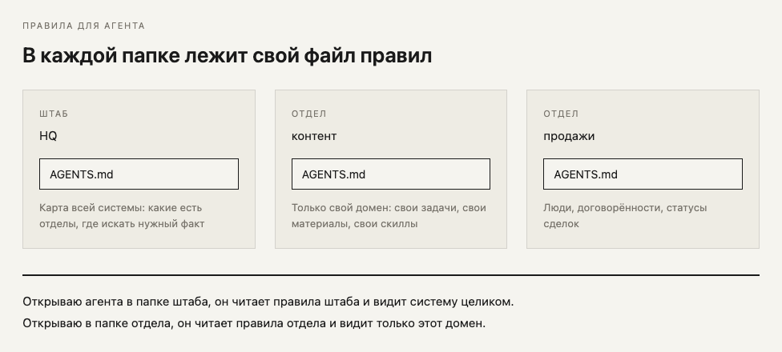
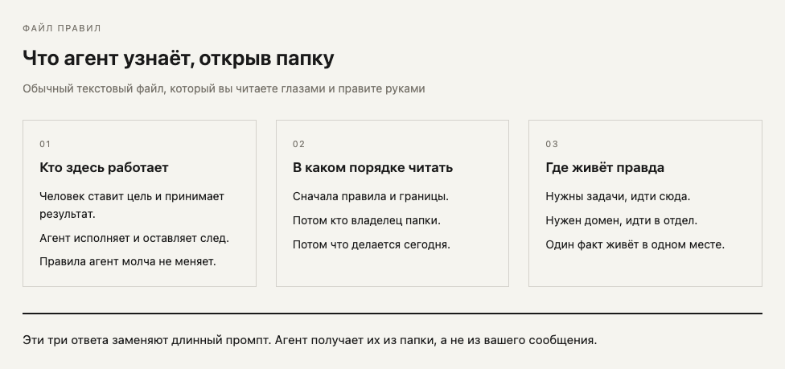
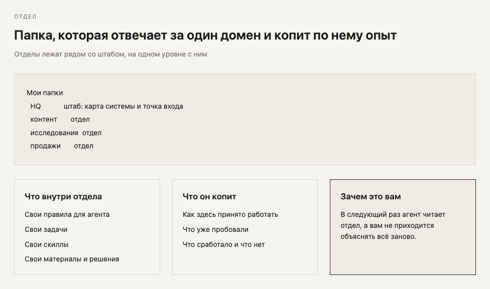
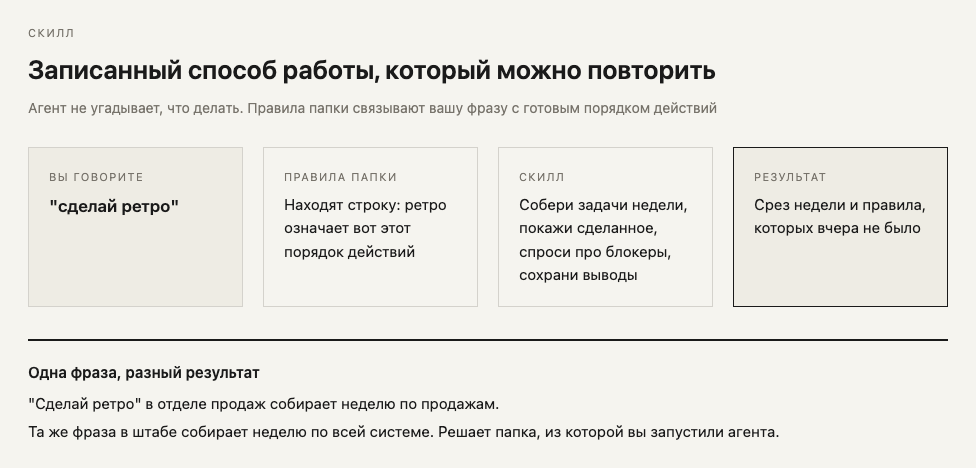
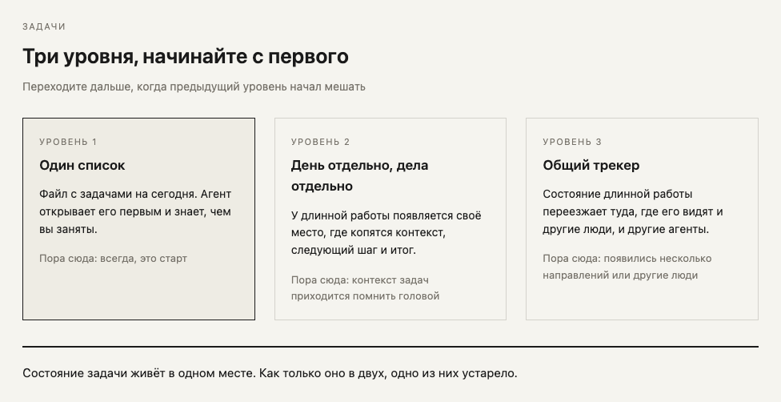

# Personal Corp OS

[](README.md)
[](README.ru.md)
[](LICENSE)
[](https://github.com/serejaris/personal-corp-os/actions/workflows/validate.yml)

> Personal Corp: способ управлять личной компанией через AI-агентов. Задачи выходят из головы, опыт копится в отделах, недельное ретро превращает его в правила.

Здесь лежит всё, что для этого нужно: рассказ про устройство системы, шаблоны штаба и отдела, открытые скиллы для [Claude Code](https://docs.anthropic.com/en/docs/claude-code) и Codex.

От [Ris](https://t.me/ris_ai). Пишу про AI-разработку и вайбкодинг.

English version: [README.md](README.md).

## Проблема: вы бутылочное горлышко

Через вас проходит всё важное. Стратегия, память, координация, исполнение и приёмка лежат в одной куче: у вас в голове. Пропускная способность отдела равна вашей.

Наняли человека. Он забрал работу, контекст остался у вас, объяснять приходится по-прежнему.

Поставили агента. История повторилась. Агент без контекста работает как новый сотрудник, который к тому же забывает вчерашний день.

Причина одна: контекст не выходит из головы. Сила модели тут ни при чём.

## Что такое правила для агента

Правила для агента это обычный текстовый файл в папке. Никакой магии: текст, который вы читаете глазами и правите руками.

Такой файл лежит в каждой папке, и содержание у него своё.



Открыв папку, агент узнаёт из этого файла три вещи.



Эти три ответа заменяют длинный промпт. Агент получает их из папки, а не из вашего сообщения, поэтому объяснять заново каждый раз не приходится.

## Главная идея: представление задаёт папка

Запускаю агента из штаба, он читает правила штаба и видит карту всей системы. Запускаю из отдела, читает правила отдела и видит свой домен, свои задачи, свои скиллы. Модель одна, представление разное. Задаёт его папка.

Дальше всё следует отсюда. Чтобы это работало, контекст должен выйти из головы в файлы, а файлы лечь по папкам с правилами.

## Что такое отдел

Отдел это папка, которая отвечает за один домен и копит по нему опыт. Внутри у неё свои правила, свои задачи и свои скиллы.



### Какие отделы бывают

У меня их около тридцати. Вот те, с которых обычно начинают:

| Отдел | Что копит | Когда пора заводить |
|---|---|---|
| Контент | Голос, темы, готовые тексты, разборы что зашло | Пишете регулярно и каждый раз объясняете агенту стиль заново |
| Исследования | Вопросы, найденные факты, источники, выводы под решения | Ищете одно и то же по второму разу |
| Продажи | Люди, договорённости, переписка, статусы сделок | Держите в голове, кому что обещали |
| Медиа | Брифы, промпты, готовые ассеты, критерии приёмки | Генерите картинки и видео, а брифы теряются |
| Юридический | Договоры, шаблоны, принятые формулировки | Каждый новый договор собираете с нуля |
| Финансы | Расходы, подписки, регулярные платежи | Не помните, за что списывается ежемесячно |

Отдел заводится под повторяемость. Пока работа случилась один раз, ей хватает штаба.

## Что такое скилл

Скилл это записанный способ работы, который можно повторить. Один раз проходите работу руками, записываете порядок шагов, дальше его выполняет агент.



## Четыре слоя и кто где живёт

| Слой | Кто действует | Что здесь лежит |
|---|---|---|
| Управления | Человек | Цель, приоритеты, лимиты, право сказать "годится" |
| **Правды** | Человек пишет, агент читает | Правила, память, индексы, источник правды |
| **Операционный** | Агент исполняет, человек принимает | Задачи, очередь, статусы, прогоны, отделы |
| Наблюдения | Агент собирает, человек смотрит | Дашборды, метрики, блокеры |

Субагент живёт только в операционном слое. Правду о системе он не пишет, результат не принимает.

Тест для любого файла: это правда о системе или результат работы? Правда лежит в папке с самого начала. Результат создаёт скилл, когда ему есть что записать. Поэтому в шаблонах пусто там, где потом появятся отчёты, решения и словари.

## Маршрут: как опыт становится капиталом


**1. Описание задачи.** Мысль становится задачей, когда у неё есть владелец, критерии готовности и место, где она лежит. До этого она живёт в вас. После её берёт и человек, и агент.

**2. Накопление опыта в отделах.** Артефакты и решения оседают в отделе, отдельной папке своего домена. В следующий раз агент читает отдел, а не вас.

**3. Ретро с агентом.** Раз в неделю вы смотрите вместе, что сработало, и поднимаете это в правила. Что поправили дважды, становится строкой правил и больше не требует вашего участия.

## Недельный ритм

Три звена по отдельности выглядят списком возможностей. Ритм превращает их в систему.


Ритм отвечает на вопрос, который обычно остаётся без ответа: когда опыт превращается в правило. Ответ: на ретро, раз в неделю.

Одно слово даёт разный результат в зависимости от папки. Ретро в отделе собирает срез отдела. Ретро в штабе собирает срез всей системы. Правила папки сильнее общих.

## Три уровня задач



## Шаблоны

| Шаблон | Что это |
|---|---|
| [`templates/hq`](./templates/hq/) | Штаб: точка входа агента и карта системы |
| [`templates/department`](./templates/department/) | Отдел: папка одного домена со своими задачами и скиллами |

Отделы лежат рядом со штабом, на одном уровне с ним. Каждый файл шаблона открывается строкой про то, зачем он здесь и к какому слою относится.

## Первый шаг: 30 минут сегодня

1. Скопируйте [`templates/hq`](./templates/hq/) к себе и заполните `me.md`.
2. Откройте агента из этой папки и попросите прочитать `AGENTS.md`.
3. Заведите первый отдел из [`templates/department`](./templates/department/) рядом со штабом, положите в него одну реальную задачу.
4. Поставьте плагин, он приносит скиллы недельного ритма. Инструкция ниже, в разделе [Установка](#установка).
5. В конце недели запустите ретро, в начале следующей планирование.

Через две такие недели у отдела появляется собственная память, и часть решений перестаёт проходить через вас.

## Четыре скилла ритма

| Скилл | Звено маршрута | Что делает |
|-------|----------------|------------|
| [corp-doctor](./skills/corp-doctor/) | Контур, отдел, задача | Диагностика и ремонт контура, новый отдел, маршрут задачи в нужный отдел |
| [manager](./skills/manager/) | Исполнение | Синк работы сессии в GitHub Issues и cross-repo запросы по задачам |
| [weekly-retro](./skills/weekly-retro/) | Паттерн в память | Структурированное ретро: сбор данных, интервью с основателем, фиксация в issues |
| [weekly-planning](./skills/weekly-planning/) | Приоритет | Ретро и бэклог собираются в приоритизированные результаты недели |

## Куда это ведёт

| Стадия | Как думаете | Где горлышко |
|--------|-------------|--------------|
| Вайбкодер | "Я и AI" | Контекст в голове |
| Оператор | "Я направляю агентов" | Координация вручную |
| CEO | "Я управляю системой" | Горлышка нет, система работает |

Ваша работа сжимается до трёх действий: задать цель, выбрать следующий ход, принять результат.

Словарь терминов лежит в [CONTEXT.md](CONTEXT.md), принятые архитектурные решения в [docs/adr/](docs/adr/).

## Установка

### Claude Code

В терминале:

```bash
claude plugin marketplace add serejaris/personal-corp-os
claude plugin install personal-corp-os@personal-corp-os
claude plugin details personal-corp-os
```

В Claude Code Desktop или interactive `/plugin` flow:

1. Откройте **Plugins** или `/plugin`.
2. Добавьте marketplace: `serejaris/personal-corp-os`.
3. Установите `personal-corp-os`.

### Codex

В репозитории есть Codex manifest: [.codex-plugin/plugin.json](.codex-plugin/plugin.json).
Добавьте marketplace из GitHub, затем установите плагин:

```bash
codex plugin marketplace add serejaris/personal-corp-os
codex plugin add personal-corp-os@personal-corp-os
```

После установки откройте новый Codex thread и проверьте:

```text
Use Personal Corp skills to plan my week.
```

### Переход с personal-corp-skills

До 06.08.2026 репозиторий назывался `personal-corp-skills`. Старые ссылки GitHub перенаправляет сам. Плагин переименован вместе с репозиторием, поэтому в Claude Code удалите установленный плагин `personal-corp-skills` через `/plugin` и поставьте новый по инструкции выше.

### Один скилл

Используйте этот вариант, если нужна одна папка скилла:

> Install this skill: `https://github.com/serejaris/personal-corp-os/tree/main/skills/cc-analytics`

Замените `cc-analytics` на имя любого скилла из таблицы ниже.


## Все скиллы

### Ритм системы

| Скилл | Что делает |
|---|---|
| [corp-doctor](./skills/corp-doctor/) | Один вход в контур: диагностика, ремонт, новый отдел, маршрут задачи |
| [manager](./skills/manager/) | Двусторонний мост между сессией и GitHub Issues, срез по трекам |
| [weekly-retro](./skills/weekly-retro/) | Недельное ретро: сбор фактов, интервью с основателем, фиксация выводов |
| [weekly-planning](./skills/weekly-planning/) | Ретро и бэклог собираются в приоритизированные результаты недели |

### От замысла к задачам

| Скилл | Что делает |
|---|---|
| [idea](./skills/idea/) | Захват одной озвученной идеи в папку с провенансом и дедупом по индексу |
| [grill-me](./skills/grill-me/) | Интервью по одному вопросу за раз, пока замысел не станет ясным |
| [to-prd](./skills/to-prd/) | Синтез обсуждения в `PRD.md` без нового интервью |
| [to-issues](./skills/to-issues/) | Разбивка PRD на вертикальные срезы `tasks/NN-slug.md` с критериями |
| [gh-issues](./skills/gh-issues/) | Работа с GitHub Issues через CLI с хранением контекста сессии |

### Продуктовая работа

| Скилл | Что делает |
|---|---|
| [pm-brainstorm](./skills/pm-brainstorm/) | Структурированная генерация идей с SCAMPER и отбором по усилию |
| [pm-feedback](./skills/pm-feedback/) | Классификация обратной связи, кластеризация тем, ранжирование болей |
| [pm-competitive](./skills/pm-competitive/) | Конкурентный анализ: SWOT, матрица функций, дифференциация |
| [pm-prioritize](./skills/pm-prioritize/) | Ранжирование бэклога через RICE, ICE, MoSCoW или Kano |
| [pm-prd](./skills/pm-prd/) | Структурированный PRD с шаблонами под тип продукта |
| [pm-user-stories](./skills/pm-user-stories/) | Разбивка эпика на user stories по INVEST со story map |
| [pm-metrics](./skills/pm-metrics/) | Обзор продуктовых метрик, воронка, удержание, сверка с целями |
| [pm-roadmap](./skills/pm-roadmap/) | Обновление дорожной карты Now/Next/Later с причинами задержек |
| [product-data-audit](./skills/product-data-audit/) | Глубокий аудит продукта и бизнеса, интерактивный отчёт на 12 секций |

### Дизайн и медиа

| Скилл | Что делает |
|---|---|
| [art-director](./skills/art-director/) | Итеративный поиск визуального стиля с журналом процесса и графом решений |
| [design-minimal](./skills/design-minimal/) | Одна HTML-страница в минимальном стиле: дашборд, бриф, раздатка, отчёт |
| [html-draft](./skills/html-draft/) | Техническая диаграмма в стиле инженерного чертежа: архитектура, потоки |
| [parallel-design-variants](./skills/parallel-design-variants/) | Параллельный отбор направлений через субагентов, галерея, голосование |

### Оркестрация агентов

| Скилл | Что делает |
|---|---|
| [ceo-council](./skills/ceo-council/) | Параллельные субагенты в ролях C-level для стратегического разбора |
| [fable-ruki-agenty](./skills/fable-ruki-agenty/) | Ручной режим оркестрации: спеки в задачи, исполнение раздаётся субагентам |

### Документы и правила

| Скилл | Что делает |
|---|---|
| [readme-generator](./skills/readme-generator/) | README для людей: структура, назначение, порядок действий |
| [claude-md-writer](./skills/claude-md-writer/) | Сборка и рефакторинг файла правил агента по проверенным практикам |

### Операции

| Скилл | Что делает |
|---|---|
| [meeting-copilot](./skills/meeting-copilot/) | Живой дашборд встречи: подготовка, обновление по транскрипту, решения |
| [cc-analytics](./skills/cc-analytics/) | Отчёт по статистике использования Claude Code |
| [safe-public-release](./skills/safe-public-release/) | Провенанс, лицензии, allowlist и проверка на чистом клоне перед публикацией |
| [tg-bot-ops](./skills/tg-bot-ops/) | Операционный плейбук для Telegram-ботов и шлюзов к агентам |

## Other

### [Statusline](./statusline/)
Кастомный статусбар с отображением затрат, использования контекста и git-ветки с цветовой индикацией.

## Архивные скиллы

Архивные скиллы сохраняются для справки и не входят в активный набор скиллов
плагина.

| Скилл | Примечание |
|-------|------------|
| [paperclip-api](./archive/skills/paperclip-api/) | Исторический helper для Paperclip API; сохранён для справки |

## Ручная установка

Скиллы — обычные папки. Копируйте всю папку скилла, чтобы не потерять optional
references и examples:

```bash
cp -r skills/<name> ~/.claude/skills/
```

## Автор

- Telegram: [@ris_ai](https://t.me/ris_ai) — AI-разработка и вайбкодинг
- YouTube: [@serejaris](https://www.youtube.com/@serejaris)
- [vibecoding.phd](https://vibecoding.phd)

## Лицензия

MIT

## Безопасность

Секреты, утечки приватных данных и exploitable behavior отправляйте приватно.
См. [SECURITY.md](SECURITY.md).
