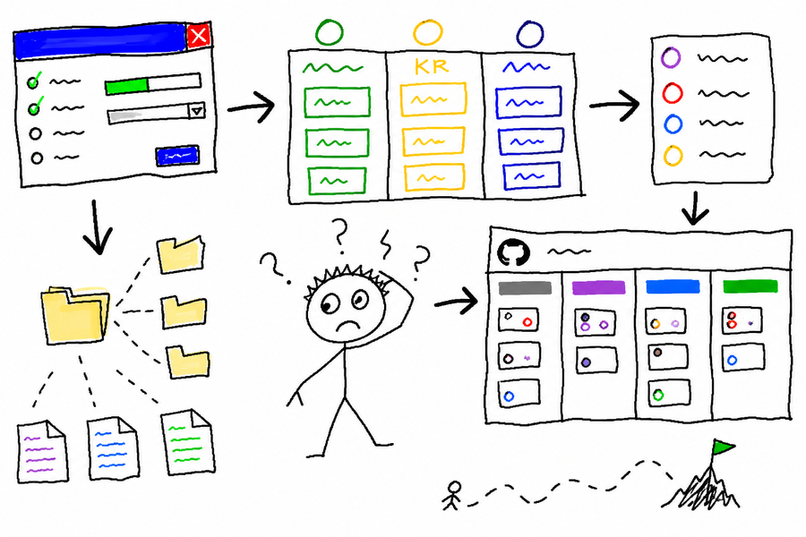

# Corp Init Skill



Скилл для первичной настройки или ремонта операционной системы Personal Corp: HQ-файлы, agent config, дневные планы, GitHub issue workflow, Projects и маршрутизация corp-* owner repos.

## Что настраивает

- `AGENTS.md` / `CLAUDE.md` с `Agent Operations Config`
- `tasks.md` как входной индекс и `tasks/WNN/YYYY-MM-DD.md` как дневные планы
- `okr.md` и `decisions.md`
- GitHub Projects и issue-инварианты для `manager`
- corp-* owner map и публичные поверхности

## Установка

```bash
cp -r skills/corp-init ~/.claude/skills/
```

## Главные правила

- Существующие файлы дополняются точечно, без полной перезаписи.
- Задача попадает в week/day plan только со ссылкой на GitHub issue.
- GitHub-записями управляет `manager`, если он доступен.
- HQ остаётся коротким; исполнение живёт в owner repos.

## См. также

- [manager](../manager/) — канонический workflow GitHub issues
- [weekly-planning](../weekly-planning/) — weekly outcomes и дневные планы
- [weekly-retro](../weekly-retro/) — ретро и scorecards
- [corp-new](../corp-new/) — регистрация нового corp-* department repo
