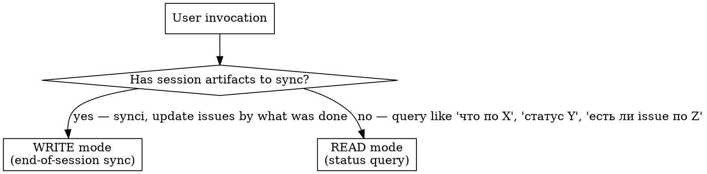
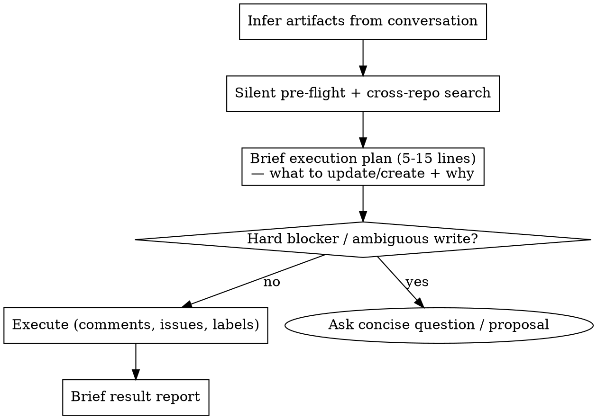

# Modes: Read vs Write — полный алгоритм

## ToC
1. [Mode resolution](#mode-resolution)
2. [Standing write authorization](#standing-write-authorization)
3. [Write mode algorithm](#write-mode-algorithm)
4. [Read mode algorithm](#read-mode-algorithm)
5. [Output language rules](#output-language-rules)
6. [Output format templates](#output-format-templates)

---

## Mode resolution



**Signal for write mode:** founder said «синкни сессию», «зафиксируй», «обнови issues», OR invoked `/manager` without args at end of session, OR explicitly listed artifacts/changes.

**Signal for read mode:** founder asked a question about state — «что по», «статус», «есть ли», «какие issues по».

**Bare `/manager` invocation:** infer artifacts from current conversation context — what tracks were touched, what files were modified/created, what decisions were made. Do NOT ask founder to re-list everything. Do NOT dump full investigation output. Read context, form brief execution plan (5-15 lines), then execute under the standing write authorization unless a hard blocker/ambiguity requires founder input.

---

## Standing write authorization

Ris has explicitly confirmed that manager GitHub writes are allowed by default. After the silent pre-flight and brief execution plan, execute scoped GitHub writes without asking a separate "подтверди" question.

Covers: body updates, work-record comments (Iron invariant 6), W-label creation, parent/sub-issue linking, Project placement in the resolved canonical/domain Project, **Project status → `In progress` for touched active issues**, **default assignee `@me` (founder) on created/touched issues** (don't overwrite an existing team/contractor assignee — see issue-authoring.md → «Assignee»), **day plan updates in `tasks/WNN/YYYY-MM-DD.md`**, and issue creation when the matching epic/repo/scope is clear. Also covers adding a clearly scoped issue to the global Ris weekly Project only when: issue is in current weekly/day plan, repo/issue/parent/W-label/track ownership are unambiguous, and live `projectItems` confirms the Project is missing.

Closing allowed only when founder explicitly says "закрой" or confirms completion of that exact issue scope.

Ask before writing only when the write is genuinely ambiguous or risky: no suitable parent epic, uncertain repo/track ownership, public-repo privacy risk, destructive/bulk changes, closing an issue whose scope is not clearly completed, or conflicting evidence. Ask one concise question with the proposed default.

---

## Write mode algorithm



---

## Read mode algorithm

1. Resolve query subject — track name, person, repo, issue number, time window.
2. Cross-repo search по нескольким ключам (Russian + English + handle + slug). При 3+ ключах — ОДИН batched GraphQL `search()` с alias'ами (см. search-algorithm.md → «Batched GraphQL search»), не N отдельных `gh search issues`. Не передавай state-квалификатор — один проход вернёт и open, и closed.
3. **Filter false-positives** — drop matches where keyword overlap is incidental (e.g. issue tagged `W18` but unrelated to the queried track). See search-algorithm.md → «False-positive surface».
4. Для всех true matches — ОДНИМ batched GraphQL-вызовом (см. search-algorithm.md → «Project evidence commands — batched GraphQL issue state») получить number, title, state, labels, last updatedAt и body excerpt (первые 200 символов или строку «Status:»). Не делать отдельный `gh issue view` на каждый match.
5. Собрать `Related` только для true matches с отдельным scope: отдельная задача, контекстная ссылка, зависимость, cross-repo артефакт или историческая задача. Отфильтровать parent/child связи, которые уже выражены через Sub-issues API.
6. Для mentoring или current-week matches: определить `track overview`, точный `S<N>` issue, дату сессии/календаря, parent, текущие labels, expected W-label и `projectItems` для доменной доски + глобальной weekly-доски. Если labels расходятся — показать `Расхождение недели`; если W-label есть, а issue отсутствует в нужном Project — показать `Расхождение Project`.
7. For current-week child issues, verify parent visibility: child Project placement/status, parent/root Project placement/status, and parent proof from both child `parent_issue_url` and parent `/sub_issues` when possible. If child-side parent reads as `null` but parent `/sub_issues` includes the child, report `parent proof: parent sub_issues ✓; child API ambiguous`, not `parent missing`.
8. Cross-reference `tasks.md` — does the track appear in current-week priority list? If yes, mark as `В плане W{NN}`.
9. Output: condensed table of matches + related context + open questions + uncovered gaps.
10. Read mode ничего не пишет в GitHub.

---

## Output language rules

Всё, что видит founder (proposal, result report, вопросы, заголовки секций) — **на русском**. Никаких смешанных «PROPOSAL → comment + W18 (kept) — Sportmaster price renegotiation».

Технические токены остаются как есть: имена issue (`crm#27`), labels (`W18`, `retro:W17`, `backlog`), команды (`gh issue comment`), пути файлов, англоязычные оригинальные заголовки issues в кавычках. Всё остальное — русским.

Заголовки новых/переименованных founder-facing issues пишутся по-русски. Английский допустим только как собственное имя продукта, бренда, repo, команды, API, label или публичного upstream-термина: `GitHub`, `Telegram`, `YouTube`, `LMS`, `OpenClaw`, `Personal Corp`, `Colvir`, `Hermes`, `LLM`, `PRD`, `E2E`, `video_id`. Английские глаголы и служебные action-фразы в title запрещены: `delivery track`, `launch/funnel`, `follow-up`, `workshop prep`, `handoff`, `rollout package`, `topic TBD`, `date TBD`.

- ❌ `SYNCED: crm#27 → comment + W19 added`
- ✅ `Обновлено: crm#27 «Спортмастер · strategy track» → комментарий + добавлен W19`

---

## Output format templates

### Issue reference format

**Always use `repo#N «человекочитаемый заголовок»` form.**

- ❌ `crm#27 → comment + W19`
- ✅ `crm#27 «Спортмастер — ответить на бриф Романа Киселёва» → комментарий + W19`

### Write mode — план (ДО исполнения)

Компактный план. Каждая строка: что сделаю + куда + зачем. Группируй по треку. Под каждым треком первой строкой — **visible root / epic** (parent issue), под ним sub-issues с пометкой parent OK / parent отсутствует. Для active/current-week child показывай обе стороны Project visibility: `child Project` и `parent/root Project`; если status lane пустая, пиши это явно.

Для mentoring-треков план обязан явно показать структуру:

```
Валентин · track <repo#TRACK> «Валентин (@xbhsy289) — трек менторства» [parent/epic: корневой track; W-label: W22 ✓; Project: Менторство 1-на-1 ✓; ris © corp ✓]
- <repo#S1> «Валентин (@xbhsy289) S1 — доставка материалов» [parent: track ✓; W-label: W22 отсутствует; Project: Менторство 1-на-1 ✓; ris © corp отсутствует → добавить, если S1 доставка активна сейчас]
  → оставить S1 хвосты доставки здесь: запись/транскрипт/workbook/LMS/отправка
- НОВЫЙ issue «Валентин (@xbhsy289) S2 — подготовить и провести сессию» [parent: track ✓; дата сессии: 2026-05-29 в body/calendar; W-label: W22 создать; Project: Менторство 1-на-1 добавить; ris © corp добавить]
  → agenda + факт лайва + доставка после S2; денег в body не пишу, CRM owner = [[valentin-xbhsy]]
- Расхождение недели: нет / или `<repo#S2> «...» — стоит W21, по дате нужен W22; действие: добавить W22`
- Расхождение Project: нет / или `<repo#S2> «...» — W22 есть, в `ris © corp` отсутствует; действие: добавить в Project`
- stale sales issue «закрыть сделку» не использую как delivery anchor; предлагаю закрыть/переименовать только после scope check
```

Пример B2B-трека:

```
План синка (W18, 30.04):

Спортмастер · epic crm#15 «Спортмастер — B2B сделка overview»
- crm#27 «Спортмастер — ответить на бриф Романа Киселёва» [parent: crm#15 ✓; W-label: W18 ✓ + добавить W19; Project: доменная доска неизвестна; ris © corp ✓]
  → обновить body: Status/Next/Updates; коммерческие условия см. в CRM `[[sportmaster-slug]]`
- crm#25 «Спортмастер — подготовить бриф-встречу 27.04 и финал 30.04» [parent: crm#15 ✓; W-label: W18 ✓; Project: доменная доска неизвестна; ris © corp ✓]
  → обновить body: встречи прошли; закрывать только если founder подтвердил completion exact scope

Smena · epic crm#10 «Smena — партнёрство на Q2 2026»
- crm#24 «Smena — расхождение CRM opp и просроченное промо Кружка» [parent: crm#10 ✓; W-label: W18 ✓; Project: доменная доска неизвестна; ris © corp ✓]
  → обновить body: Status/Next/Updates; retro:W17 не трогаю
- teach-vibecoding#250 «Smena retreat — программа в LMS для сменщиков» [parent: ОТСУТСТВУЕТ; W-label: W18 ✓; Project: ris © corp отсутствует → добавить после parent fix]
  → привязать как child crm#10 + обновить body про видео до 04.05
- НОВЫЙ issue в crm: «Smena — объём вырос без пересмотра цены» [deadline: 2026-05-05 в body; W-label: W18+W19; child crm#10]

Лейблы создать: W19 в serejaris/crm
Родительские epic'и без покрытия:
- (нет — все треки сессии имеют epic)

Незакомиченное в crm: meetings/2026-04-30.md (новый), opp карточки — закоммитить до синка?

Выполняю дальше по standing authorization. Если видишь ошибку в scope — останови/поправь.
```

Если у трека нет работающего epic'а:

```
⚠️ Нет epic'а трека: «<X>» не имеет родительский issue. Предлагаю:
   - Создать crm#NEW «<X> — overview» как зонт; все 3 issue ниже становятся sub-issues.
   ИЛИ
   - Использовать существующий <repo#N> «<title>» (sub_summary total=N)
```

Если parent API есть, но Project view не группирует child:

```
Расхождение Project: parent epic not visible
- <child repo#N> «title» [parent API: <parent repo#M> ✓; child Project: ris © corp ✓; parent Project: отсутствует / status empty]
  → добавить/fix parent/root в Project <name> и выставить status lane; hierarchy не менять до re-read
```

### Write mode — отчёт (ПОСЛЕ исполнения)

```
Готово:
- crm#27 «Спортмастер — стратегический трек» — обновлён body, добавлена W19; parent: crm#15 ✓; W-label: W18+W19 ✓; Project: ris © corp **In progress** ✓
- tasks/W24/2026-06-09.md — добавлена строка P0 по touched track ✓
- crm#24 «Smena: расхождение CRM opp» — обновлён body; parent: crm#10 ✓; W-label: W18 ✓; Project: ris © corp ✓
- teach-vibecoding#250 «smena-retreat» — обновлён body + привязан child crm#10; W-label: W18 ✓; Project: ris © corp добавлен ✓
- crm#42 «Smena — объём вырос без пересмотра цены» — создан, child crm#10; W-label: W18+W19 ✓; Project: ris © corp добавлен ✓
- W19 лейбл создан в serejaris/crm

Пропущено по твоему решению: crm#25 «Спортмастер — подготовка…» — оставлен открытым; parent: crm#15 ✓; W-label: W18 ✓; Project: ris © corp ✓
```

### Read mode

Компактная таблица — всегда с колонкой «Заголовок», parent epic в отдельной колонке, без голых номеров:

```
Запрос: «что по Спортмастеру»

Epic трека: crm#15 «Спортмастер — B2B сделка overview» (3/5 done)

Открытые sub-issues:
| Issue | Заголовок | Parent | W-label | Project | Активность | Статус |
|---|---|---|---|---|---|---|
| crm#27 | Спортмастер — ответить на бриф | crm#15 ✓; parent Project ✓ | W18 | child Project ✓ | 2026-04-29 | Активный — КП до 04.05 |
| crm#25 | Спортмастер — подготовить бриф и финал | crm#15 ✓ | W18 | ris © corp ✓ | 2026-04-27 | Обе встречи прошли — возможно устарел |
| corp-decks#9 | Спортмастер — презентация экспресс-аудита | — ⚠️ | W18 | ris © corp ✓ | 2026-04-28 | Без parent, надо привязать к crm#15 |
| corp-decks#10 | Спортмастер — черновик КП | crm#15 ✓ | — ⚠️ | отсутствует ⚠️ | 2026-04-30 | Расхождение недели: нет W-label, добавить W18; затем добавить в Project |

В tasks.md:
- W18 приоритет 4 — «КП Спортмастеру»; deadline: 2026-05-04

Не покрыто (пробел):
- Нет issue под написание самого КП (только бриф/prep). Создать на следующем синке?

Проверка трека:
- 1 issue без parent epic — corp-decks#9. Привязать на следующем синке.
- W-label по issues: crm#27 W18 ✓; crm#25 W18 ✓; corp-decks#9 W18 ✓; corp-decks#10 отсутствует → добавить W18.
- Project placement: crm#27 ris © corp ✓; crm#25 ris © corp ✓; corp-decks#9 ris © corp ✓; corp-decks#10 отсутствует → добавить в Project после W-label.

Отфильтровано (ложные совпадения):
- crm#1 «monotributo: завершить alta» — выпал по W18-лейблу, к Спортмастеру не относится
```
