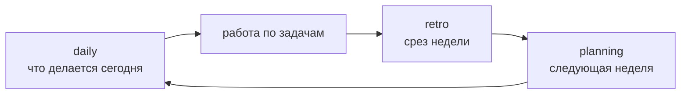

# Отдел

> Папка, которая отвечает за один домен и копит по нему опыт. Живёт **рядом со штабом, не внутри него**.

Отдел нужен, когда у работы появляется повторяемость: один и тот же тип задач, одни и те же материалы, один и тот же способ проверки результата. Пока повторяемости нет, отдел заводить рано.

## За что отвечает этот отдел

`<одно предложение: какой повторяемый результат создаёт отдел>`

## Что в папке

| Файл | Слой | Зачем он здесь |
|---|---|---|
| [`AGENTS.md`](./AGENTS.md) | правды | Правила отдела, границы, маршрут запросов к скиллам |
| [`CLAUDE.md`](./CLAUDE.md) | правды | Подключает те же правила для Claude Code |
| [`tasks/README.md`](./tasks/README.md) | операционный | Контракт задач: где состояние, какие статусы, как перейти в трекер |
| [`tasks/_template.md`](./tasks/_template.md) | правды | Форма длительной задачи: результат, состояние, следующий шаг, итог |
| [`skills/`](./skills/) | правды | Три скилла ритма отдела |

## Порядок действий

1. Скопируйте папку рядом со штабом и назовите по домену.
2. Замените `<...>` в `README.md` и `AGENTS.md`.
3. Добавьте отдел в таблицу "Отделы рядом" в `AGENTS.md` штаба.
4. Откройте агента из этой папки и заведите первую реальную задачу по форме из `tasks/_template.md`.

## Рабочий ритм отдела

Это ритм **одного отдела**. Срез по всем отделам сразу принадлежит штабу и запускается оттуда.

## Что появится позже само

| Появится | Когда | Кто создаёт |
|---|---|---|
| `tasks/ГГГГ-ММ-ДД-название.md` | С первой длительной задачей | человек по форме `_template.md` |
| `reports/` с недельными срезами | После первого ретро | `retro` и `planning` |
| `materials/` | Когда появятся исходники домена | человек |
| `CONTEXT.md` со словарём домена | Когда термины начнут расходиться | domain-modeling |

Пустые папки под будущие артефакты в шаблоне не лежат намеренно: пустой файл выглядит как правда, но правдой не является.

## Где живёт результат

Сам результат остаётся в системе, которой он принадлежит. Пост живёт на площадке публикации, карточка клиента в CRM, документ в проекте. Запись задачи хранит ссылку на результат, копию она не держит.
